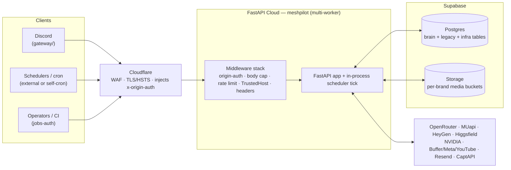

# MeshPilot — Architecture

<p align="center">
  <strong>One autonomous AI marketing agent — memory, a reasoning loop, a policy gate,
  a learning curator, and a growing set of tools — running 24/7 on managed cloud.</strong>
</p>

<p align="center">
  
  
  
  
</p>

---

> **This is the deep engineering reference.** For the product overview, the two
> system diagrams, the tech-stack table, and quickstart, start at
> **[`README.md`](README.md)**. This document goes a level below that: runtime
> topology, the loop internals, the memory + data model, and the security model.
> When the two overlap, the README is the summary and this is the detail; when
> either disagrees with the code, the code (and the contract docs in `docs/`) win.

---

## Contents

- [The rebuild — from a mesh to one agent](#the-rebuild--from-a-mesh-to-one-agent)
- [Runtime topology](#runtime-topology)
- [The agent loop (internals)](#the-agent-loop-internals)
- [Memory & learning](#memory--learning)
- [Data model](#data-model)
- [Security model](#security-model)
- [Configuration model](#configuration-model)
- [Media factory](#media-factory)
- [Legacy LangGraph pipeline](#legacy-langgraph-pipeline-superseded-still-wired)
- [Chat control plane](#chat-control-plane)
- [Deployment & CI](#deployment--ci)
- [Testing](#testing)
- [Contributing](#contributing) · [License](#license)

---

## The rebuild — from a mesh to one agent

MeshPilot is the **standalone extraction and correction** of an earlier attempt —
the Mesh Pilot monorepo
([`meshpilot-digital-marketing-stack`](https://github.com/Nuraveda-Labs/meshpilot-digital-marketing-stack),
now a public archive), which tried to run
**six specialist agents** in a mesh underneath a full SaaS product (operator
cockpit, approval control plane, warehouse, billing). The complexity multiplied
faster than the value. This repo threw out the mesh and the SaaS scaffolding and
kept one goal: **one autonomous agent that works unattended on the cloud.**

The Python package is `meshpilot` (a name inherited from the extraction). It
was lifted out of the monorepo, decoupled, and rebuilt around a cognitive
substrate — memory, a native tool-use loop, a deterministic policy gate, and a
learning curator. Proven logic from the monorepo is **pulled and adapted** (the
"bible" pattern), never inherited wholesale. The one large piece carried over
mostly intact is the old **LangGraph video pipeline**, which still runs but is
[superseded](#legacy-langgraph-pipeline-superseded-still-wired) by the brain.

Everything the old ARCHITECTURE.md described — Upload-Post / Zernio vendors,
direct TikTok OAuth, a Telegram approval bot, an ORM (reputation-management)
subsystem, `DISPATCH_MODE=dry_run|live` as the master switch, systemd + nginx on
a box — is **gone or demoted**. The vendor fan-out was cut to Buffer / Meta /
YouTube (VENDOR-1), the ORM subsystem was deleted (PRUNE-1), the chat surface is
now a Discord gateway, and the whole thing is **boxless** on FastAPI Cloud.

---

## Runtime topology

One deployable service, multi-worker, behind Cloudflare, with Supabase for state.



**Key consequences of this topology:**

- **Multi-worker ⇒ no in-process state that must be shared.** Any state a request
  needs to read back later lives in Postgres. Background agent runs are persisted
  to `agent_runs` and polled by id (`GET /internal/agent/run/{id}`); the rate
  limiter and webhook-dedup can use Postgres-shared tables for the same reason.
  In-process routing metrics are deliberately per-worker; durable per-model spend
  lives in `usage_events`.
- **Cloudflare is the only front door.** `/internal` and `/jobs` require the
  CF-injected `x-origin-auth` header — a direct-to-origin call to those paths
  returns **403 by design** (see [Security model](#security-model)).
- **The Mac never runs the agent.** It edits code, commits, and triggers deploys;
  the agent lives in the deployed service.

---

## The agent loop (internals)

The heart is `agent/loop/runner.py` — a **native tool-use** cycle (not JSON-in-text
ReAct; the old `parse_action` parser is gone). Per run:

1. **(optional) Reckoning — expectation.** If `agent_reckoning_enabled`, capture a
   before-the-fact expectation of the run (`agent/loop/reckoning.py`). Foresight,
   not hindsight.
2. **Seed recall.** Pull per-brand context from memory.
3. **Plan.** Call **Claude via OpenRouter** (`agent/loop/llm.py`) with the offered
   tool definitions; the model returns `tool_use` blocks.
4. **Scope check → policy gate.** Two independent layers:
   - **Scope** (`agent/loop/scopes.py`) decides which tools are even *offered* this
     run (`chat` default / `discovery` / `content_draft` / `content` / `orm` /
     `full`). A hallucinated out-of-scope `tool_use` is refused at dispatch.
   - **Policy** (`agent/loop/policy.py`) is the deterministic *allow/deny* gate run
     before every offered call: per-brand denies, capability kill-switches
     (publish / web / email / discovery), and per-run + per-brand-daily cost
     budgets. **Scope = OFFERED, policy = ALLOWED — both must pass.**
5. **Execute → observe.** Run the tool, feed a `tool_result` back, loop until the
   model stops requesting tools.
6. **Write episode.** Persist what happened.
7. **(optional) Conscience + reckon.** If enabled, an **independent critic**
   (`agent/loop/conscience.py`, fresh context — it never sees the actor's
   transcript) reviews the outward-intended output against the constitution
   (`agent/CONSCIENCE.md`) → `pass` / `concerns` / `escalate`, fed only
   [operator-verified](#memory--learning) brand facts as ground truth; and
   Reckoning self-assesses the run vs its expectation (tagged self-assessed, never
   trusted as verified). Both are **advisory today — they block nothing**; when
   outward actions are enabled, the same critic becomes a pre-commit hard gate.
8. **Curate.** The [learning curator](#memory--learning) distils the episode into
   durable lessons that resurface via recall next time.

### Model router

`agent/loop/routing.py` maps a task **tier** — `critical` / `complex` (default) /
`moderate` / `simple` — to an **ordered list of models**, sent to OpenRouter as its
`models` array so **failover across providers is native** (e.g. `complex` =
`anthropic/claude-sonnet-5` → `z-ai/glm-5.3` → `moonshotai/kimi-k3`). Models are
still Claude slugs by default, normalized via a `_MODEL_MAP`. An env override
`AGENT_ROUTER_<TIER>` (comma-separated slugs) pins a tier. Anthropic-only features
(prompt caching, `output_config.effort`) are **not** sent over OpenRouter.

A data-grounded **audit** (`agent/loop/audit.py`) reads `usage_events` and flags
`primary_idle` (a tier's primary model served 0 calls while a fallback did —
informational, since usage rows don't carry the requested tier) and
`cost_per_call_drift`. Exposed at `GET /internal/agent/routing/{metrics,audit}`
and runnable nightly as the `routing_audit` cron capability.

### Self-cron

The agent can schedule its **own** future work via the `schedule` tool
(`agent/cron/`). Jobs (`scheduled_jobs` / `scheduled_runs`) are claimed
exactly-once (`FOR UPDATE SKIP LOCKED`) and either re-invoke the loop (`agentTurn`)
or run a `capability`. A self-scheduled job's scope is **clamped to a subset** of
the run that created it, so the agent can't widen its own powers. Gated by
`agent_cron_enabled`; driven by the same in-process scheduler tick.

### Cost metering

Every paid call is self-metered at the choke point into `usage_events` (per-brand,
attributed via a contextvar): the loop LLM (`openrouter`) and the media engines
(`muapi`, `higgsfield`, `heygen`). `GET /internal/analytics/{spend,budget,reconcile}`
roll it up; the policy gate reads the daily budget before spending. Metering is
fail-soft — it never breaks generation.

---

## Memory & learning

Per-brand memory lives in **`agent_memory`** (Supabase Postgres): `kind in
('fact','episode')`, `halfvec(2048)` embeddings (HNSW) from **NVIDIA NIM**
(nemotron) plus a Postgres FTS index. `recall()` fuses semantic + lexical scores;
`remember()` upserts facts by key. See `docs/plans/2026-08-29-agent-brain.md` for
the schema and rationale.

- **Operator-verified provenance (security-relevant).** The conscience critic
  treats a fact as authoritative ground truth **only** when it carries
  operator-verified provenance — `metadata.verified = true` or an **exact**
  reserved `source` in `store.VERIFIED_SOURCES` (`operator_verified` /
  `operator-verified`). Trust is never inferred from arbitrary `source` substrings
  (`unverified`, `self-verified`, free text are rejected). The agent's own tools
  write `source=agent_loop` / `curator`, so a self-authored or prompt-injected
  "fact" can never pass as verified. The filter is applied **in the recall query**
  (`recall(..., verified_only=True)`) so `LIMIT` bounds the filtered set.
- **Curator** (`agent/learn/curator.py`) — a Hermes-style pass that distils
  episodes into durable, deduped lessons (stored as facts), closing the loop:
  *act → remember → learn → act better.*

---

## Data model

All tables enable **Row-Level Security with a deny-all posture** (migration
`..._supa_harden.sql`): no policy grants anon/authenticated access — every read and
write goes through the service-role backend. Timestamps are naive-UTC
(`datetime.now(timezone.utc)`).

**Agent brain + infra (current):**

| Table | Purpose |
|---|---|
| `agent_memory` | per-brand facts + episodes; pgvector + FTS hybrid recall |
| `agent_runs` | persisted background runs (+ deliberation), pollable by id |
| `usage_events` | per-brand vendor spend meter (dedup'd) |
| `scheduled_jobs` · `scheduled_runs` | agent self-cron (exactly-once claim) |
| `brand_document` | brand docs uploaded to the Anthropic Files API |
| `oauth_tokens` | MCP OAuth tokens (HeyGen etc.), encrypted — distinct from `platform_auth` |
| `balance_snapshots` | vendor-balance snapshots for spend reconciliation |
| `webhook_dedup` · `rate_counters` | shared-state infra (idempotency, cross-worker rate limiting) |
| `waitlist` | landing-page signups |

**Legacy pipeline (present, still used by the LangGraph path):** `signal`,
`content_script`, `video_job`, `video_asset`, `scheduled_post`, `published_post`,
`metrics_snapshot`, `scout_checkpoint`, `mention_event`, `platform_auth` (Fernet-
encrypted OAuth tokens), `orm_response`, `comment_reply`, `strategic_reply`.


## Security model

**Middleware stack** (`server.py`, installed inner→outer):
`SecurityHeaders → CORS → TrustedHost → RateLimit → BodySizeLimit → OriginAuth`.

- **OriginAuth** (`middleware/originauth.py`) — gates `/internal` and `/jobs` only;
  constant-time compares `x-origin-auth` against `ORIGIN_SHARED_SECRET` (injected
  by a Cloudflare Transform Rule); **403 on mismatch**. Excludes `/healthz`,
  `/oauth/*`, `/media/fetch`. **Fail-open if the secret is unset** — startup logs a
  warning; set the secret in prod.
- **Jobs-auth** (`_require_jobs_auth`) — validates `x-jobs-token` against a
  **brand-scoped** `<PREFIX>_JOBS_AUTH_TOKEN` resolved from the `?brand=` query
  param. Fails **closed**: missing config → 503, mismatch → 401.
- **Brand authorization** (`_authorized_brand`) — derives the acting brand strictly
  from `?brand=` (default brand if absent) and **rejects a mismatched body `brand`
  with 400** (BFLA fix, #95) — the body can never redirect an action to another
  tenant.
- **RateLimit** — per-IP + global sliding window (in-process or Postgres-shared via
  `RATE_LIMIT_SHARED`); exempts `/healthz`, `/webhooks*`, `/resend/webhook`.
- **BodySizeLimit** — raw-ASGI 413 cap (Content-Length + streamed bytes).
- **Kill-switches** — every outward/paid capability ships **OFF**:
  `agent_publish_enabled`, `agent_web_fetch_enabled`, `agent_discovery_enabled`,
  `agent_email_enabled`, `agent_conscience_enabled`, `agent_reckoning_enabled`,
  `agent_cron_enabled` all default `False`.
- **`web_fetch` SSRF guard** (`agent/loop/tools.py`) — http(s)-only, canonical-host
  (IDNA + trailing-dot) blocked-domain matching, async DNS with every resolved IP
  required public, the connection **pinned to the validated IP** (Host + TLS SNI
  preserved) so there's no DNS-rebinding window, `trust_env=False`, no redirects,
  and a hard response-byte cap.
- **Secrets** — `crypto.py` uses Fernet (`AUTH_ENCRYPTION_KEY`) to encrypt
  `platform_auth` tokens at rest; `oauth_tokens` are encrypted too. Sentry is
  PII-scrubbed (strips `x-jobs-token`, auth headers, cookies). No global provider
  credentials — everything resolves per-brand (below).

---

## Configuration model

**Per-brand, no globals.** Each brand (project) brings its own keys; everything
resolves as `<BRAND>_<KEY>` (e.g. `ACME_META_APP_ID`, `ACME_JOBS_AUTH_TOKEN`). The bundled
example brand, Acme Supply Co. (`ACME`, `brand/configs/example.json`), shows the shape;
`DEFAULT_BRAND_ID` names the fallback.

**Global infra keys** (shared capabilities, not brand identity): `OPENROUTER_API_KEY`
(brain + copy), `MUAPI_API_KEY` (image/video), `NVIDIA_API_KEY` (embeddings),
`CAPTAPI_KEY` (discovery), `AUTH_ENCRYPTION_KEY` (Fernet), `SIGNAL_DB_URL`
(Postgres). `ANTHROPIC_API_KEY` is used **only** for the Files API (brand-doc
grounding), not the loop. `.env` is gitignored and every var the agent reads is
documented in `.env.example`.

**Feature flags** live in `config.py` (pydantic-settings) and all default off /
conservative: the kill-switches above plus `agent_default_scope="chat"`,
`agent_max_steps_ceiling=12`, `agent_max_media_per_run=3`,
`agent_brand_daily_budget_usd=0.0`, `agent_cron_max_jobs_per_brand=20`,
`enable_api_docs=False`.

---

## Media factory

Image/video generation is a **deterministic runner over a pluggable `Engine`
protocol** (`media/generation/`): **MUapi** (image/video), **HeyGen** (avatar
video, via MCP + OAuth token refresh), **Higgsfield** (Soul/DoP). It executes
**recipes** — `recipe_library/<slug>/` = a `SKILL.md` bundled verbatim from the
installed `muapi-*` skills (provenance) + a structured `recipe.json` (the execution
plan). Template recipes need no LLM; prompt-authored ones use an injectable
composer. Endpoints: `/internal/media/{recipes,generate,ensure-bucket}`.

Generated assets are persisted to **per-brand Supabase Storage buckets**
(`<env_prefix>-media`) so links don't expire, and the durable public URL is
returned. **Content *text* (captions, scripts, replies) runs on Claude**, not
MUapi — `agent/llm.py::chat()` routes `cheap`→`simple` / `smart`→`complex` through
the same OpenRouter router. Deterministic image edits use Pillow (`edit_image`).

---

## Legacy LangGraph pipeline (superseded, still wired)

The original video pipeline is still built at startup and reachable, but the brain
is the path forward. It owns the `signal…published_post` legacy tables and these
endpoints:

- `POST /jobs/scout` — mine signals → script → storyboard → video gen → assemble → QC.
- `POST /jobs/drive_scout?brand=` — pick up pre-edited Drive footage → caption.
- `POST /jobs/assemble/{script_id}` — assemble a generated video.

`DISPATCH_MODE=dry_run|live` governs *this* pipeline's publishing (synthetic ids in
dry-run); the brain instead uses per-capability kill-switches. `sheet_posting/`
(Google-Sheet-driven posting) and the `scheduler/` tick also live here. Treat this
subsystem as maintenance-only unless a lane says otherwise.

---

## Chat control plane

`gateway/` is a **thin Discord bridge — not a second agent**. It forwards a channel
message to `POST /internal/agent/run?brand=` (with `x-jobs-token`), polls
`GET /internal/agent/run/{id}` until the run finishes, and posts the reply back.
Deployed on **Railway** via watch-paths (`gateway/**`) straight from `production`
(the old `gateway-production` branch was retired 2026-08-30). Telegram / WhatsApp
adapters would follow the same pattern.

---

## Deployment & CI

- **Host:** any ASGI host. The maintainers run FastAPI Cloud behind Cloudflare;
  the specific app, region and team are deployment detail and deliberately not
  recorded here. Entry `main.py` → `meshpilot.server:app`; startup inits
  Sentry/Logfire, installs middleware, builds the (legacy) graph, starts the
  scheduler tick, and spawns the HeyGen-MCP OAuth keepalive (~30 min).
- **Branches — single trunk, no `main`/`preview`:** `production` is the trunk *and*
  the API deploy branch (GitHub default); lanes PR **into** it and merging
  auto-deploys. `web-production` is the `web/` waitlist site (Cloudflare Pages),
  fast-forwarded from `production`. Deploy branches are never developed on.
- **CI (`.github/workflows/ci.yml`) runs on push to `production`, drift-aware:**
  `pytest` + import smoke on API drift; a from-scratch **migration replay +
  idempotency re-apply** (pgvector/pg17) on `supabase/migrations/` or `db/` drift;
  `npm run build` on `web/` drift; `py_compile` + `docker build` on `gateway/`
  drift; **nothing** (fast pass) for docs. CI validates; it is not a pre-merge
  gate, so run `uv run pytest -q` locally before merging.

**Runtime gotchas (keep them):** use `fastapi[standard]` (the cloud launches via
the `fastapi run` CLI); `greenlet` must be an explicit dep (SQLAlchemy async);
`env set` is create-only — delete then recreate to update a var; never keep
runtime state in an in-process dict (multi-worker — persist it); behind Cloudflare,
`/internal` + `/jobs` need `x-origin-auth` (direct-to-origin → 403 by design).

---

## Testing

```bash
uv sync
uv run pytest -q        # 558 passed, 1 skipped (network-free; stores/engines are injectable)
uv run ruff check src/ tests/
```

Tests mock the DB engine and provider clients (injectable seams), so the suite runs
with no keys and no network. A change isn't done until the suite is green and the
contract docs + lane board are updated.

---

## Contributing

Doc-driven repo (vibe-coding-kit method). Open a **lane** (`lane/*` off
`production`), read the required docs (`docs/DOC-SYSTEM.md` →
`control-plane/ACTIVE_LANE_BOARD.md` → the lane's spoke docs), keep the change
small and tested, and **PR into `production`**. Commits are SSH-signed; never commit
directly on `production` or a `*-production` deploy branch. A lane isn't closed
until the contract docs are updated and evidence is appended to
`control-plane/ENGINEERING_SUPERVISOR.md`. See [`CONTRIBUTING.md`](CONTRIBUTING.md).

## License

**GNU AGPL-3.0-or-later** — see [`LICENSE`](LICENSE). MeshPilot is **open-core**:
the agent is free and self-hostable; a managed, multi-tenant hosted platform is the
paid product (the Supabase model). Run a modified version as a network service and
the AGPL's network-copyleft applies — make your source available to its users, or
take the commercial/hosted option.

---

Built in the open by [**Nuraveda Labs**](https://github.com/Nuraveda-Labs) · [meshpilot.app](https://meshpilot.app)
