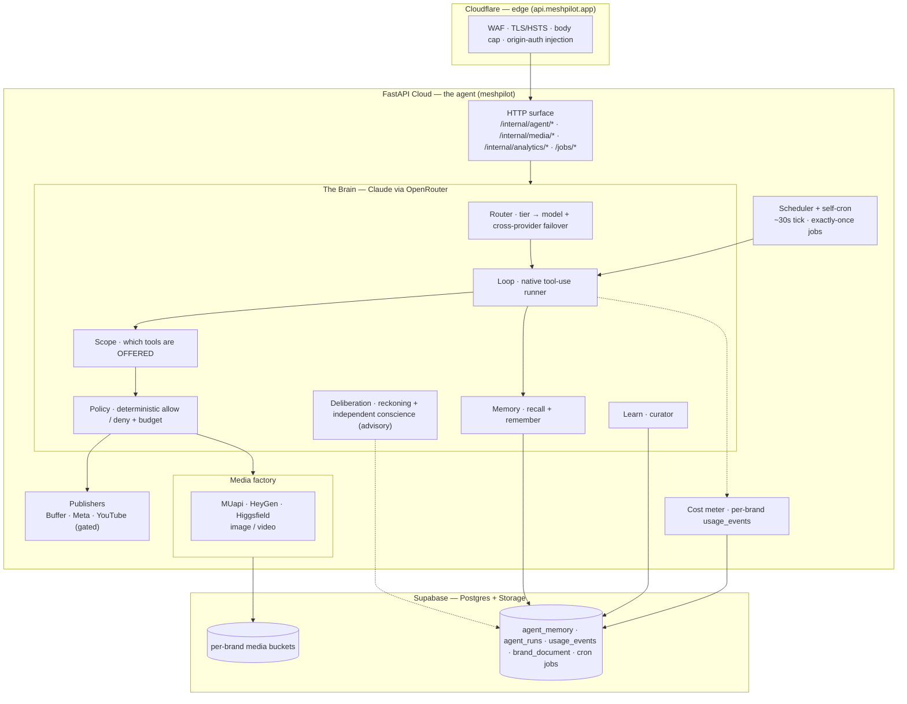
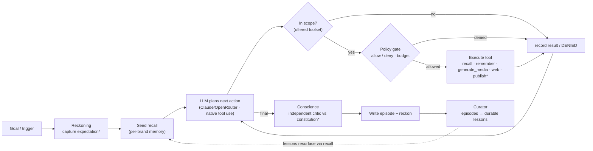

<div align="center">

# 🛰️ MeshPilot

### An autonomous marketing agent that runs **N brands, each sealed from the others**.

A single, **self-hostable AI agent** with memory, judgment, its own tools and a
learning loop, built to run **autonomously, 24/7**. What makes it different from
the other agent frameworks is not the loop — it is that **every credential resolves
`<PREFIX>_<KEY>` from the brand's own config**, so the agent running brand A
structurally cannot reach brand B's keys. Outward capabilities ship **OFF**, a
deterministic policy gate stands between a decision and an action, and the
publishers actually publish.

[](LICENSE)
[](https://www.python.org/)
[](https://fastapi.tiangolo.com/)
[](https://www.anthropic.com/)
[](../../actions)
[](CONTRIBUTING.md)
[](../../stargazers)

**[Live API](https://meshpilot.app)** · **[Vision](docs/VISION.md)** · **[Architecture](#how-it-works-the-architecture)** · **[Quickstart](#quickstart)** · **[Ecosystem](#ecosystem)** · **[Contributing](CONTRIBUTING.md)**

</div>

---

> **🟢 Open source · AGPL-3.0 · open-core.** This agent is free and self-hostable
> — read it, run it, extend it. A managed, multi-tenant **hosted platform** (run
> the agent for you, at scale) is the paid product. Same model as Supabase: open
> core, paid cloud. The maintainers operate a live instance at
> **[`api.meshpilot.app`](https://api.meshpilot.app)** (FastAPI Cloud) — you can
> run your own the same way.

Most "AI marketing" tools are a chat box bolted onto an API. **MeshPilot is a
standing autonomous worker** that runs headless whether or not anyone is watching
— *and* you can talk to it from **Discord** when you want to.

**Where it sits against the frameworks you already know:**

| | Shape | What it does not have |
|---|---|---|
| [OpenClaw](https://github.com/openclaw/openclaw) | an agent around a messaging gateway | single-operator; no multi-tenant credential model |
| [Hermes Agent](https://github.com/hermes-agent/hermes) | a gateway around a learning agent | learning-first; no multi-tenant credential model |
| **MeshPilot** | **both** — chat control plane *and* a learning curator | — it is the multi-brand one |

Those two are excellent and far larger. The gap this fills is narrow and specific:
**running several brands out of one agent without their credentials touching.**

> Deployment is a convenience, not the pitch: there is no VM to patch and you ship
> by `git push`. Worth knowing, but nobody adopts a framework for where it deploys —
> and an always-on container still has to exist somewhere (see
> [the scheduler notes](#scheduler) for the honest version).

## Contents

- [**Multi-brand isolation**](#multi-brand-isolation-the-part-that-matters)
- [Why this exists](#why-this-repo-exists-and-why-we-ditched-the-last-one)
- [What it is (60 seconds)](#what-it-is-the-60-second-version)
- [Talk to it (chat control plane)](#talk-to-it-chat-control-plane)
- [How it works — architecture](#how-it-works-the-architecture)
- [Tech stack](#tech-stack)
- [Projects × Capabilities](#projects--capabilities)
- [What the agent exposes](#what-the-agent-exposes)
- [Quickstart](#quickstart)
- [Deploy](#deploy-fastapi-cloud)
- [Ecosystem](#ecosystem)
- [License](#license) · [Contributing](#contributing) · [Acknowledgements](#acknowledgements)

---

## Multi-brand isolation (the part that matters)

Every project — a brand, a client, a persona — declares an `env_prefix` in its own
config under `brand/configs/`. Every credential is then read as `<PREFIX>_<KEY>`:

```jsonc
// brand/configs/example.json
{ "brand_id": "example", "env_prefix": "ACME", ... }
```

```bash
ACME_META_APP_ID=...        # Acme's Meta app
ACME_BUFFER_API_KEY=...     # Acme's Buffer
OTHER_META_APP_ID=...       # a different project's, unreachable from Acme's run
```

`brand_env()` is the one way capabilities read project-scoped secrets, and it does
**not** fall back to an unprefixed variable. In this codebase it is used at **27**
call sites against **1** that permits a fallback.

> ⚠️ **That one exception is the sharp edge, and it is worth your attention.**
> `brand_env_or_default()` resolves `<PREFIX>_<KEY>` and *then* falls back to the
> bare `<KEY>`. It exists for genuinely shared infrastructure — in this repo, a
> single Google Drive service account.
>
> **The failure mode is silent and real.** If a project is missing its
> `<PREFIX>_META_PAGE_ID` while a global `META_PAGE_ID` is set, a fallback lookup
> resolves to *the other project's Page* and publishes there. Nothing errors. We
> found this in our own deployment on 2026-09-20 before it published anything, and
> the reason it is in the README rather than a comment is that a per-brand
> credential model is only as good as its exceptions.
>
> **If you add a credential, use `brand_env()`.** Reach for
> `brand_env_or_default()` only for infrastructure genuinely shared across every
> project, and never for anything that identifies a destination — a page, a
> channel, an account, a repo.

Outward and paid capabilities ship **OFF** and must be deliberately enabled:
`agent_publish_enabled`, `agent_web_fetch_enabled`, `agent_discovery_enabled`,
`agent_email_enabled`, `agent_conscience_enabled`, `agent_reckoning_enabled`,
`agent_cron_enabled`. A fresh clone can think, and cannot act outward.

---

## Why this repo exists (and why we ditched the last one)

The predecessor — the **Mesh Pilot monorepo**
([`meshpilot-digital-marketing-stack`](https://github.com/Nuraveda-Labs/meshpilot-digital-marketing-stack),
now a **public archive** — our reference "bible") — tried to be everything at once: **six specialist agents**
(Ads, Sales, Social, Voice, SEO, UGC) wired into a mesh, sitting underneath a full
**SaaS product** — an operator cockpit, approval/audit control plane, a data
warehouse, a BYO-MCP acquisition funnel, plan tiers and billing.

It was impressive, and it was **too much**. Every capability multiplied against
every other; the SaaS surface multiplied against every agent; the coordination
cost grew faster than the value. We were building six agents *and* a company
around them before a **single** agent could stand on its own and work unattended.
The complexity, not the idea, is what stalled it.

**This repo is the correction.** We threw out the mesh and the SaaS scaffolding
and kept exactly one goal:

> **Build a digital AGI robot — one autonomous agent — that works 24/7 on the
> cloud.**

One process. One clear substrate: memory, a reasoning loop, a policy gate, a
learning curator, and a growing set of tools. Everything the monorepo proved is
still valuable — we **pull the proven logic and adapt it** (the bible pattern),
but we never inherit its *shape*. Scope is a feature. When a choice is unclear,
the simpler thing that keeps one agent autonomous wins.

---

## What it is (the 60-second version)

- It holds **per-brand memory** (durable facts + episodes of what it did).
- It runs a **native tool-use loop** that recalls context, plans, and calls its
  **tools** — read/write memory, generate media, search/fetch the web, read a
  brand's documents, discover trending content, publish, email, schedule its own
  future work (the outward ones gated) — then records what happened.
- Each run has a **scope** that bounds which tools are even offered, and a
  **deterministic policy gate** sits in front of every call: unsafe or disabled
  actions are refused before they run (publishing/web/email/discovery ship off).
- It can **deliberate**: an optional independent *conscience* reviews outward output
  against a constitution, and a *reckoning* pass checks each run against a
  before-the-fact expectation (both advisory, default off).
- A **curator** distills its episodes into durable lessons, so the next run starts
  smarter. The loop closes: *act → remember → learn → act better.*

It is **multi-brand from day one** (Projects × Capabilities, below) and **cloud-only** —
nothing runs from a developer's Mac; the Mac edits code, commits, and triggers
deploys. The agent lives in the deployed service.

---

## Talk to it (chat control plane)

MeshPilot isn't a dashboard you babysit — it's an agent you **message**. A thin
**channel gateway** (a small always-on bridge, *not* a second agent) connects your
chat apps to the agent: you type in a channel, MeshPilot runs a turn and replies.

- **Discord** — live today. Talk to the agent in a private channel; it answers
  in-thread. The bridge is [`gateway/`](gateway/) — ~90 lines of `discord.py`,
  deployed as one always-on managed container.
- **Telegram · WhatsApp** — next, as small adapters on the same pattern.

This is the "our own OpenClaw" idea: one agent you reach across every channel — but
the brain stays a managed-cloud service and the channel layer stays lean. The agent
is always MeshPilot; the gateway is dumb plumbing (message in → `/internal/agent/run`
→ reply out).

---

## How it works (the architecture)

Two model backends, split by job. **Claude — reached through OpenRouter** — is the
agent's *brain* (multi-step reasoning via **native tool use**) **and writes the
copy** (captions, scripts, replies). **MUapi** is the *media factory* (one gateway
for image and video generation). A quality-first **model router** picks the model
per task and **fails over across providers** automatically. The agent never
confuses the brain from the media factory.



### The autonomous loop

This is the heart — what runs per brand, unattended. Publishing is a gated tool;
memory and learning are always-on.



<sub>* Reckoning and Conscience are advisory and default-off (`agent_reckoning_enabled` / `agent_conscience_enabled`); publish/web tools are gated.</sub>

Three things make it safe to leave running: **(1)** each run has a **scope** that
bounds *which* tools are even offered, and **(2)** every offered tool call still
passes the deterministic **policy gate** (publish/web/email denied unless their
switch is on; per-run + per-brand-daily cost budgets); **(3)** background runs are
persisted in Postgres (`agent_runs`), so they survive the multi-worker cloud and
are pollable by run id. A self-scheduling job's scope is clamped to a subset of the
run that created it, so the agent can't widen its own powers.

### The Brain (cognitive substrate)

All live and verified:

- **MEM** — per-brand memory in Supabase (`agent_memory`): facts + episodes, hybrid
  recall (pgvector semantic + Postgres FTS, fused). `agent/memory/`.
- **LOOP** — a **native tool-use** runner over **Claude** (`tool_use` → `tool_result`,
  parallel-safe) that recalls, plans, calls tools, and writes an episode;
  backgrounded + DB-backed for the cloud. `agent/loop/`.
- **ROUTER** — a quality-first model router: each task tier (`critical` / `complex` /
  `moderate` / `simple`) maps to an ordered model list sent as OpenRouter's `models`
  array, so failover across providers is native (Claude → GLM → Kimi, …). Env
  override `AGENT_ROUTER_<TIER>`. A data-grounded **audit** (`audit.py`) reads
  `usage_events` and flags `primary_idle` / `cost_per_call_drift`. `agent/loop/routing.py`.
- **POLICY** — a deterministic allow/deny gate run before every tool: per-brand
  denies, **kill-switches** (publish / web / email / discovery), and per-run +
  per-brand-daily cost budgets. `agent/loop/policy.py`.
- **SCOPE + PIPELINES** — each run carries a **scope** (`chat` default / `discovery` /
  `content` / `orm` / `full`) bounding *which* tools are offered — a layer above the
  policy gate (scope = OFFERED, policy = ALLOWED). Capabilities only turn on inside a
  declarative **pipeline** (discovery / content / orm), each with its own scope, goal,
  and cadence. `agent/loop/scopes.py`, `agent/loop/pipelines.py`.
- **DELIBERATION** — two advisory, default-off passes wrapping a run: **Reckoning**
  (capture an expectation *before* acting, self-assess after — grounded in the
  transcript, never trusted as verified) and an independent **Conscience** critic
  (fresh context, can't see the actor's reasoning) that reviews the outward output
  against a written constitution (`agent/CONSCIENCE.md`) → `pass` / `concerns` /
  `escalate`, fed only **operator-verified** brand facts as ground truth.
  `agent/loop/{reckoning,conscience}.py`.
- **LEARN** — a Hermes-style curator that distills episodes into durable lessons
  (stored as facts, deduped, idempotent), closing the self-improvement loop.
  `agent/learn/curator.py`.
- **SELF-CRON** — the agent schedules its **own** future work via the `schedule`
  tool; jobs are claimed exactly-once (`FOR UPDATE SKIP LOCKED`) and re-invoke the
  loop (`agentTurn`) or run a capability. Gated by `agent_cron_enabled`. `agent/cron/`.

Patterns adapted from **Hermes** (memory-first + curator) and **OpenClaw**
(trusted-gateway / deterministic policy / self-cron). See
`docs/plans/2026-08-29-agent-brain.md` and the dated design docs in `docs/plans/`.

---

## Tech stack

| Layer | Technology | Notes |
|---|---|---|
| Language / runtime | **Python ≥ 3.11**, `uv` | one import root under `src/` |
| API framework | **FastAPI** (`fastapi[standard]`, uvicorn) | the agent's only control surface |
| Hosting | **FastAPI Cloud** | `api.meshpilot.app`; multi-worker |
| Edge / CDN | **Cloudflare** | WAF, TLS/HSTS, origin-auth; Pages for the web |
| Database | **Supabase Postgres** (asyncpg, SQLModel/SQLAlchemy) | `agent_memory`, `agent_runs`, `oauth_tokens`, … |
| Vectors | **pgvector** (`halfvec`, HNSW) | semantic recall in `agent_memory` |
| Object storage | **Supabase Storage** | per-brand media buckets (`<prefix>-media`) |
| Brain LLM | **Claude via OpenRouter** (OpenAI-compatible) | native tool-use loop + curator + content copy; model **router** with cross-provider failover |
| Embeddings | **NVIDIA NIM** (nemotron) | memory recall |
| Media — generate | **MUapi** (image/video) · **HeyGen** (avatar video, via MCP) · **Higgsfield** (Soul/DoP) | pluggable `Engine` protocol (text moved to Claude) |
| Media — edit | **Pillow** | native deterministic `edit_image` |
| Agent framework | **custom native tool-use loop** + **MCP client** (`mcp` SDK) | LangGraph for the legacy video pipeline |
| Publishing | **Buffer** · **Meta Graph API** · **YouTube** | gated OFF by policy |
| Email | **Resend** | agent `send_email` (gated OFF) |
| Cost / budget | **self-metered** `usage_events` (per-brand) | meters OpenRouter + media vendors; per-run + daily budgets |
| Web (waitlist) | **Next.js** (App Router, static export) → **Cloudflare Pages** | `web/`, `meshpilot.app` |
| Migrations | **Supabase-native SQL** | `supabase/migrations/*.sql` (Alembic retired) |
| CI/CD | **GitHub Actions** (drift-aware) | runs on push to `production` |
| Observability | **Logfire** · **Sentry** · **structlog** | |
| Secrets / auth | FastAPI Cloud env secrets · **Fernet** (token storage) · **OAuth 2.0** (HeyGen MCP) | per-brand `<PREFIX>_*`, no globals |

---

## Projects × Capabilities

The agent serves **many brands (projects) at once**, and gains **capabilities**
over time — the two axes are independent.

- **Projects** — each brings its *own* keys and infra (Meta app, Buffer token,
  Google service account, brand config). **No global credentials**: everything
  resolves per-brand as `<BRAND>_<KEY>` (e.g. `ACME_META_APP_ID`). A second project
  declaring `env_prefix: "BETA"` reads `BETA_*` and is structurally incapable of
  reaching the first one's credentials — it never builds their names.
- **Capabilities** — pluggable modules that own their routes, scheduler hooks, and
  config. Live today: **social publishing** (Buffer / Meta / YouTube), the **media
  factory** (image/video), **web research** (search/fetch), **brand-doc grounding**
  (Files API), **trending discovery** (CaptAPI), and **email** (Resend) — most gated
  off. Future: SEO, paid ads, deeper analytics — each a module on the same agent,
  not a new agent.

---

## What the agent exposes

One deployable service. The maintainers run it on FastAPI Cloud behind Cloudflare;
nothing here depends on that choice.

| Surface | What |
|---|---|
| `/` (your own host) | The agent |
| `/healthz` | Liveness (exempt from auth + rate limit) |
| `/internal/agent/{remember,recall,run,curate}` + `GET /internal/agent/run/{id}` | Brain: memory, backgrounded loop, curator (jobs-auth) |
| `/internal/agent/pipeline/{name}` + `/schedule` | Run or schedule a discovery/content/orm pipeline (409 if its switch is off) |
| `/internal/agent/routing/{metrics,audit}` | Per-worker routing metrics + data-grounded routing audit |
| `/internal/brand/{brand}/documents` (POST/GET/DELETE) | Brand-doc ingest for grounded answers (Files API) |
| `/internal/analytics/{spend,budget,reconcile}` | Per-brand cost rollup, budget, vendor-balance reconcile |
| `/internal/media/{recipes,generate,ensure-bucket}` | MUapi media factory → per-brand Supabase buckets |
| `/internal/cron/*` | Cron jobs the agent (or an operator) schedules |
| `/internal/{buffer,facebook,instagram,youtube}/*` | Publisher test/introspection endpoints (gated) |
| `/jobs/{scout,drive_scout,assemble}` | Legacy LangGraph content pipeline (superseded by the brain; still live) |

- **LLM split:** **Claude via OpenRouter** is the brain **and writes the copy**
  (`OPENROUTER_API_KEY`, models still Claude slugs, router picks the tier);
  **MUapi = image/video only** (`MUAPI_API_KEY`). `ANTHROPIC_API_KEY` is used only
  for the Files API (brand-doc grounding). Embeddings via **NVIDIA NIM**.
- **Data:** Supabase Postgres + Storage buckets (your own project).
  **All outward/paid capabilities ship OFF by default** — `agent_publish_enabled`,
  `agent_web_fetch_enabled`, `agent_discovery_enabled`, `agent_email_enabled`,
  `agent_conscience_enabled`, `agent_reckoning_enabled`, `agent_cron_enabled` are all
  `False` until deliberately enabled.
<a id="scheduler"></a>
- **Scheduler:** an in-process ~30s tick. ⚠️ **Read this before choosing a host.**
  A serverless host that reclaims the container on idle kills the scheduler with it,
  and the symptom is silence, not an error — we lost scheduling windows to exactly
  this. The same dispatch is endpoint-reachable, so an external cron or any
  always-on container can drive it; ours is the Discord gateway, which has to be
  always-on anyway. "No server" is not a thing this or any agent truly gets.
- **Chat control plane:** a small Discord bridge ([`gateway/`](gateway/), one
  always-on container on Railway) relays `#agent-chat` messages to
  `/internal/agent/run` and posts the reply back — talk to the agent from Discord.

---

## Repo layout

```
main.py                     FastAPI Cloud entrypoint → meshpilot.server:app
src/meshpilot/
  server.py                 FastAPI app + startup (installs middleware, starts scheduler)
  config.py                 pydantic-settings; all runtime config via env (per-brand <TAG>_*)
  agent/
    loop/                   BRAIN — native tool-use runner, OpenRouter llm + model router,
                            policy gate, scopes, pipelines, reckoning, conscience, tools, runs
    memory/                 BRAIN — per-brand facts+episodes, hybrid recall, NVIDIA embeddings
    learn/                  BRAIN — curator (episodes → durable lessons)
    cron/                   BRAIN — agent self-cron (exactly-once jobs; agentTurn / capability)
    discovery/              CaptAPI trending-content client (discover_trending tool)
    documents.py files.py   Brand documents via the Anthropic Files API (read_brand_doc tool)
    llm.py                  CONTENT copy → Claude via the loop router (MUapi is image/video only)
    graph.py nodes/         Legacy LangGraph video pipeline (superseded; QC on Claude vision)
  analytics/cost/           Per-brand cost metering (usage_events), budget gate, reconcile
  media/                    Media factory — recipes + pluggable engines (MUapi · HeyGen · Higgsfield), storage
  webhooks/                 Provider callbacks (e.g. /webhooks/heygen — HMAC-verified)
  middleware/               CF hardening — security headers, body cap, origin-auth, rate limit
  platforms/ integrations/  Publisher clients (Buffer, Meta, YouTube, Drive/Sheets)
  scheduler/                Recurring dispatch tick loop
  sheet_posting/            Sheet-driven recurring posting
  db/  oauth/  crypto.py    SQLModel + async session; per-platform token storage (Fernet)
supabase/migrations/        Supabase-native SQL migrations (Alembic retired)
brand/                      Per-brand config templates (real values are env/secret)
web/                        Waitlist site (Next.js) — deployed separately via Cloudflare Pages
docs/                       Doc-driven workflow (start at docs/DOC-SYSTEM.md; north star docs/VISION.md)
control-plane/              ACTIVE_LANE_BOARD.md · SESSION_COORDINATION.md · ENGINEERING_SUPERVISOR.md
```

---

## Quickstart

- **Python** ≥ 3.11, managed with `uv`.
- **Database:** external PostgreSQL (Supabase). Connection via `SIGNAL_DB_URL`
  (else `DATABASE_URL`); normalized to asyncpg, `ssl="require"`, pooler-safe
  (`statement_cache_size=0`).

```bash
uv sync
cp .env.example .env          # OPENROUTER_API_KEY · MUAPI_API_KEY · NVIDIA_API_KEY · SIGNAL_DB_URL
                              # ...plus your own per-brand <PREFIX>_* secrets
uv run pytest -q              # the suite must be green before you ship
uv run fastapi dev main.py    # local run
```

---

## Deploy

Any ASGI host works. The maintainers use FastAPI Cloud; the app id, team and region
are deployment detail and are deliberately not published here.

- **Branch model — single trunk, no `main`/`preview`:**
  - **`production`** — the trunk **and** the API deploy branch (GitHub default).
    Lanes PR **into** it; merging auto-deploys the agent. Protected — never commit
    directly.
  - **`web-production`** — the `web/` waitlist site (Cloudflare Pages),
    fast-forwarded from `production`.
- **CI** runs **on push to `production`** (drift-aware): pytest on API drift, a
  Supabase-migration apply on DB drift, the Next build on `web/` drift.
- **Migrations** are Supabase-native (`supabase/migrations/*.sql`), applied by the
  Supabase↔GitHub integration on merge. **Additive migrations before code, removals
  after.**

```bash
# manual deploy from this dir (uses FASTAPI_CLOUD_TOKEN)
uvx --from "fastapi[standard]" fastapi cloud deploy .
```

**Runtime gotchas (learned the hard way — keep them):**
- **`fastapi[standard]`**, not bare `fastapi` — the cloud launches via the
  `fastapi run` CLI, which lives in that extra.
- **`greenlet`** must be an explicit dep (SQLAlchemy async needs it).
- **`env set` is create-only** for an existing var — delete then recreate to update.
- **Multi-worker:** never keep runtime state in an in-process dict — it isn't
  pollable across workers. Persist it (that's why background runs live in `agent_runs`).
- **Behind Cloudflare:** `/internal` + `/jobs` require the CF-injected `x-origin-auth`;
  a direct-to-origin call to those paths returns `403` **by design**.

---

## Doc index (start points)

This is a **doc-driven** repo (vibe-coding-kit method). Before code, read in order:

| Doc | What it holds |
|---|---|
| `docs/VISION.md` | The north star — cloud agent, Projects × Capabilities, principles |
| `docs/DOC-SYSTEM.md` | The doc map + precedence |
| `control-plane/ACTIVE_LANE_BOARD.md` | The live lane queue |
| `docs/THE-METHOD.md` · `docs/ROLES.md` | How the multi-agent team works a lane |
| `docs/plans/2026-08-29-agent-brain.md` | The brain design (MEM · LOOP · POLICY · LEARN) |
| `docs/vendors/` | Cloudflare, FastAPI Cloud, MUapi, … runbooks |
| `ARCHITECTURE.md` | Deep architecture reference (runtime topology, loop internals, data + security model) |

A lane isn't done until the contract docs are updated and evidence is appended to
`control-plane/ENGINEERING_SUPERVISOR.md`.

---

## Ecosystem

MeshPilot is the flagship of [**Nuraveda Labs**](https://github.com/Nuraveda-Labs)
— an open ecosystem of composable, self-hostable marketing agents and MCP servers
(SEO, ads, social, UGC, sales, voice, plus MCP servers like
[linkedin-ads-mcp](https://github.com/Nuraveda-Labs/linkedin-ads-mcp)). The agent
orchestrates; each piece can also run on its own. **See the
[org profile](https://github.com/Nuraveda-Labs) for the full list.**

## License

**GNU AGPL-3.0-or-later** — see [`LICENSE`](LICENSE). MeshPilot is **open-core**:
the agent is free and open source, and you may self-host and modify it. Because
it's AGPL, if you run a modified version **as a network service**, you must make
your source available to its users under the same license. A commercial, managed
**hosted platform** (the paid product) is offered separately by the maintainers —
if the AGPL's network-copyleft doesn't fit your use, that hosted option (or a
commercial license) is the path.

## Contributing

Issues and PRs welcome. This is a doc-driven repo (see the doc index above and
[`CONTRIBUTING.md`](CONTRIBUTING.md)): open a **lane** (`lane/*` off `production`),
keep the change small and tested (`uv run pytest -q`), and **PR into `production`**.
Commits are **SSH-signed**; never commit directly on `production` or a
`*-production` deploy branch. Content the agent writes must pass the content
policy (no AI footprints) — the same bar applies to docs.

## Acknowledgements

MeshPilot's brain stands on prior open work. Its memory-first, self-improving loop
draws on **[Hermes](https://github.com/NousResearch)** (NousResearch) patterns, and
its trusted-gateway / untrusted-execution / deterministic-policy shape and self-cron
draw on **[OpenClaw](https://github.com/openclaw/openclaw)**. We adapted those ideas
to a cloud, multi-brand stack rather than wrapping either — with gratitude to both
communities.

---

<div align="center">

**If MeshPilot is useful to you, give it a ⭐ — it helps others find it.**

Built in the open by [**Nuraveda Labs**](https://github.com/Nuraveda-Labs) · [meshpilot.app](https://meshpilot.app)

*Autonomous AI marketing agent · open-core · self-hostable · AGPL-3.0*

</div>
